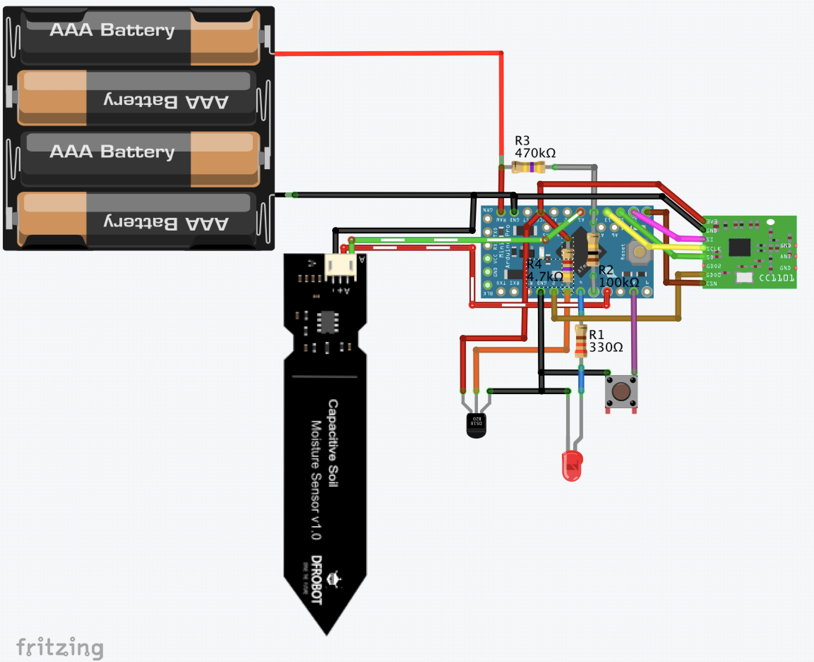
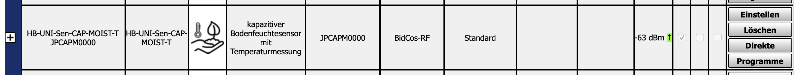
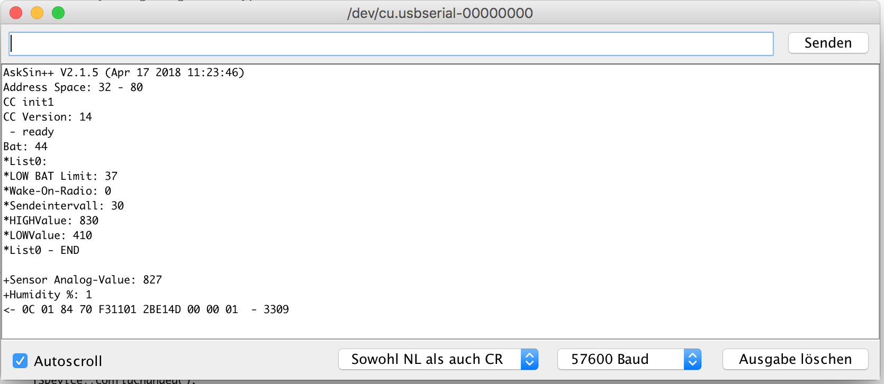
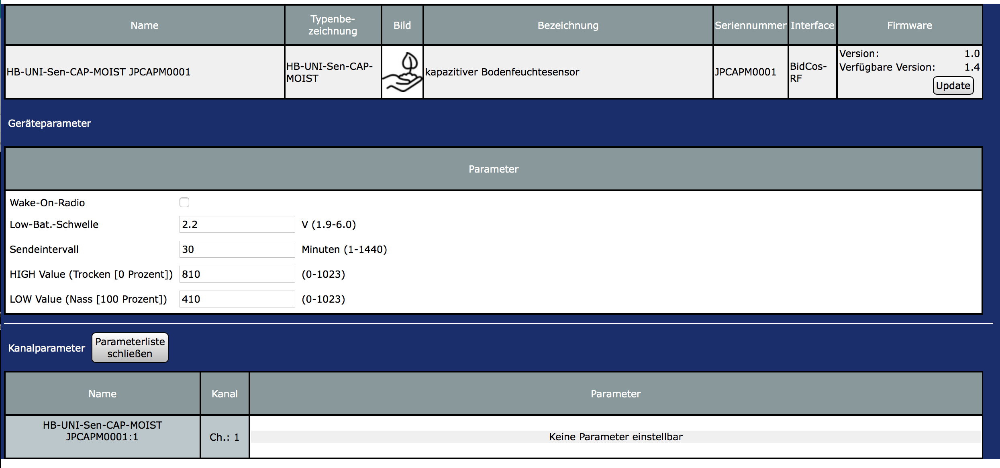
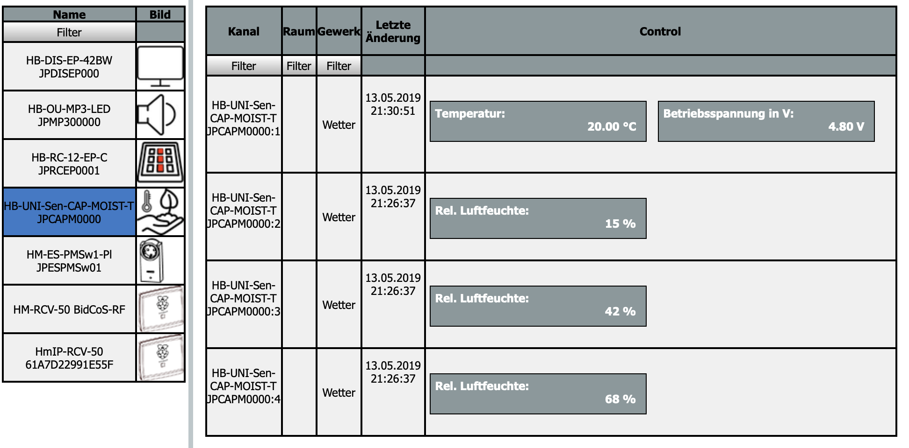

# HB-UNI-Sen-CAP-MOIST
## Funk "kapazitiver Bodenfeuchtesensor" mit _optionalem_ Temperatursensor DS18B20 für die Integration in HomeMatic
#### (mit bis zu 7* Sensoren pro Gerät)
_*6 bei zusätzlicher Verwendung des Temperatursensors_

Um die Geräteunterstützung zu aktivieren, wird die aktuellste Version des [JP-HB-Devices Addon](https://github.com/jp112sdl/JP-HB-Devices-addon/releases/latest) (mind. Version 2.7) benötigt! 
 

## Verdrahtung

## benötigte Hardware
* 1x Arduino Pro Mini **ATmega328P (3.3V / 8MHz)**
* 1x CC1101 Funkmodul **(868 MHz)**
* 1x FTDI Adapter (wird nur zum Flashen benötigt)
* 1x Taster (beliebig... irgendwas, das beim Draufdrücken schließt :smiley:)
* 1x LED 
* 1x Widerstand 330 Ohm (R1)
* 1x Widerstand 100k (R2)
* 1x Widerstand 470k (R3)
* 1x (optional) Widerstand 4,7k (R4) _nur bei Verwendung mit DS18B20 Temperatursensor_
* 1x (optional) DS18B20 Temperatursensor
* 1x ... 7x kapazitiver Feuchtesensor (0...3V Ausgangsspannung) [ebay](https://www.ebay.de/itm/152873639264)

Um die [Batterielebensdauer zu erhöhen](https://asksinpp.de/Grundlagen/01_hardware.html#stromversorgung), ist es unbedingt notwendig, die LEDs vom Arduino Pro Mini von der Platine zu entfernen!

Die Stromversorgung besteht bspw. aus **3x** AA(A)-**Batterien** (oder **4x 1.2V Akkus**). 

## Platine
</img> 
...gibts von [>>>Marco<<<](https://github.com/stan23/myPCBs/tree/master/HB-UNI-Sen-CAP-MOIST-T)

## Code flashen
- [AskSinPP Library](https://github.com/pa-pa/AskSinPP) in der Arduino IDE installieren (master-Branch ab 13.05.2019 verwenden!)
  - Achtung: Die Lib benötigt selbst auch noch weitere Bibliotheken, siehe [README](https://github.com/pa-pa/AskSinPP#required-additional-arduino-libraries).
- [Projekt-Datei](https://raw.githubusercontent.com/jp112sdl/HB-UNI-Sen-CAP-MOIST/master/HB-UNI-Sen-CAP-MOIST.ino) herunterladen.
- Arduino IDE öffnen
  - Heruntergeladene Projekt-Datei öffnen
  - Werkzeuge
    - Board: Arduino Pro or Pro Mini
    - Prozessor: ATmega328P (3.3V 8MHz) 
    - Port: entsprechend FTDI Adapter
einstellen
- ggf. Anpassungen im Code durchführen (z.B. bei mehreren Sensoren)
  - Code-Optionen:
    - wenn **kein** Temperatursensor angeschlossen werden soll, sind die Kommentarzeichen zu entfernen: `// #define NO_DS18B20 //use model without temperature sensor`
    - Pins anpassen: `const uint8_t SENSOR_PINS[]    {15, 16, 17}; //AOut Pins der Sensoren (hier A1, A2 und A3)` 
`//bei Verwendung von > 3 Sensoren sollten die Vcc der Sensoren auf 2 Enable Pins verteilt werden (max. Last pro AVR-Pin beachten!)` `const uint8_t SENSOR_EN_PINS[] {6};`
- Menü "Sketch" -> "Hochladen" auswählen.

## Gerät anlernen
Wenn alles korrekt verkabelt und das Addons installiert ist, kann das Gerät angelernt werden. 
Über den Button "Gerät anlernen" in der WebUI öffnet sich der Anlerndialog. 
Button "HM Gerät anlernen" startet den Anlernmodus. 
Nun ist der Taster (an Pin D8) kurz zu drücken. 
Die LED leuchtet für einen Moment. 
Anschließend ist das Gerät im Posteingang zu finden. 
Dort auf "Fertig" geklickt, wird es nun in der Geräteübersicht aufgeführt. 

  
## Kalibrierung
Der [Hersteller des Sensors](https://www.dfrobot.com/wiki/index.php/Capacitive_Soil_Moisture_Sensor_SKU:SEN0193) sieht eine manuelle Kalibrierung vor. 
Es müssen die Spannungswerte für beide Feuchte-Grenzen (trocken / nass) ermittelt werden. 
Der Wert wird beim Starten des Arduino Pro Mini im seriellen Monitor (57600 Baud) angezeigt. 
Siehe `+Analog   (#n):`  

Zur Kalibrierung startet man nun den Arduino Pro Mini ein Mal mit trockenen Sensoren und ein Mal in ein Glas Wasser eingetaucht.

_Der Wert im Trockenen muss höher sein als im Nassen!_

  
Beide Werte können nun in der WebUI-Gerätekonfiguration eingegeben werden.

## Einstellungen
- Gerät:
  - Low Bat Schwelle
    - ~3.7V
  - Das Sendeintervall kann zwischen 1 und 1440 Minuten eingestellt werden. 
- je Kanal:
  - HIGH Value ist der gemessene Analogwert, wenn der Sensor trocken ist. 
  - LOW Value ist der gemessene Analogwert, wenn der Sensor komplett nass (in Wasser eingetaucht) ist. 

  
## Wert anzeigen
Unter "Status und Bedienung" -> "Geräte" kann der Feuchtigkeitswert angezeigt werden. 
Damit man den Datenpunkt auch in Diagrammen verwenden kann, habe ich den systeminternen Datentyp `HUMIDITY` verwendet.
Das hat jedoch einen kleinen Schönheitsfehler zur Folge: Die Bezeichnung lautet "Rel. Luftfeuchte".
Damit kann man wohl leben... :) 

Eine Verwendung in Programmen ist ebenfalls möglich.

## Gehäuse
- [Gehäuse von "tonischabloni"](https://www.thingiverse.com/thing:3633804) auf Thingiverse: 
</img>
 

## Mein Prototyp

