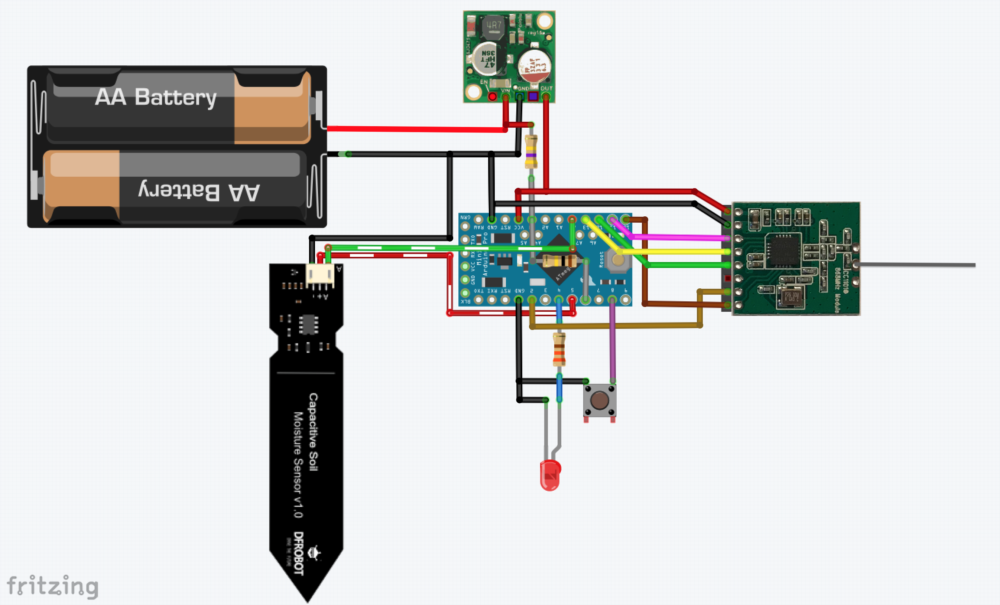
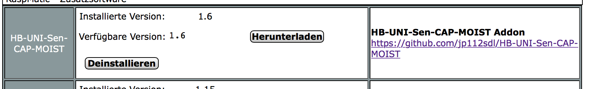

# HB-UNI-Sen-CAP-MOIST
## Funk "kapazitiver Bodenfeuchtesensor" für die Integration in HomeMatic

## benötigte Hardware
* 1x Arduino Pro Mini **ATmega328P (3.3V / 8MHz)**
* 1x CC1101 Funkmodul **(868 MHz)**
* 1x FTDI Adapter (wird nur zum Flashen benötigt)
* 1x Taster (beliebig... irgendwas, das beim Draufdrücken schließt :smiley:)
* 1x LED 
* 1x Widerstand 330 Ohm (R1)
* 1x Widerstand 100k (R2)
* 1x Widerstand 470k (R3)
* 1x StepUp-Wandler **3.3V** (BL8530 o.ä.) [ebay](https://www.ebay.de/itm/382058974507)
* 1x kapazitiver Feuchtesensor (0...3V Ausgangsspannung) [ebay](https://www.ebay.de/itm/152873639264)
* Draht, um die Komponenten zu verbinden

Um die Batterielebensdauer zu erhöhen, ist es unbedingt notwendig, die grüne LED vom Arduino Pro Mini mit einem kleinen Schraubendreher oder Messer von der Platine zu entfernen!

## Code flashen
- [AskSinPP Library](https://github.com/pa-pa/AskSinPP) in der Arduino IDE installieren
  - Achtung: Die Lib benötigt selbst auch noch weitere Bibliotheken, siehe [README](https://github.com/pa-pa/AskSinPP#required-additional-arduino-libraries).
- [Projekt-Datei](https://raw.githubusercontent.com/jp112sdl/HB-UNI-Sen-TEMP-DS18B20/master/HB-UNI-Sen-CAP-MOIST/HB-UNI-Sen-CAP-MOIST.ino) herunterladen.
- Arduino IDE öffnen
  - Heruntergeladene Projekt-Datei öffnen
  - Werkzeuge
    - Board: Arduino Pro or Pro Mini
    - Prozessor: ATmega328P (3.3V 8MHz) 
    - Port: entsprechend FTDI Adapter
einstellen
- Menü "Sketch" -> "Hochladen" auswählen.

## Addon installieren
In der CCU2 (oder RaspberryMatic) muss vor dem Anlernen noch ein Addon installiert werden. 
Dieses kann [hier](https://github.com/jp112sdl/HB-UNI-Sen-CAP-MOIST/raw/master/Addon/HB-UNI-Sen-CAP-MOIST-addon.tgz) heruntergeladen werden. 
_Hinweis: Die Datei darf nicht entpackt werden!_ 
Über "Einstellungen"->"Systemsteuerung"->"Zusatzsoftware" wählt man die Datei aus und klickt auf "Installieren".
Die CCU2 startet automatisch neu. 
**Achtung: Nachdem das System wieder hochgefahren ist, muss noch einmal ein Neustart erfolgen!** 
**"Einstellungen"->"Systemsteuerung"->"Zentralenwartung", Button "Neustart"** 
Nun ist das Addon einsatzbereit. 

## Gerät anlernen
Wenn alles korrekt verkabelt und das Addons installiert ist, kann das Gerät angelernt werden. 
Über den Button "Gerät anlernen" in der WebUI öffnet sich der Anlerndialog. 
Button "HM Gerät anlernen" startet den Anlernmodus. 
Nun ist der Taster (an Pin D8) kurz zu drücken. 
Die LED leuchtet für einen Moment. 
Anschließend ist das Gerät im Posteingang zu finden. 
Dort auf "Fertig" geklickt, wird es nun in der Geräteübersicht aufgeführt. 

  
## Gerät einstellen
- Das Sendeintervall kann zwischen 1 und 1440 Minuten eingestellt werden. 
- HIGH Value ist der gemessene Analogwert, wenn der Sensor trocken ist. 
- LOW Value ist der gemessene Analogwert, wenn der Sensor komplett nass (in Wasser eingetaucht) ist. 

  
## Wert anzeigen
Unter "Status und Bedienung" -> "Geräte" kann der Feuchtigkeitswert angezeigt werden. 
Damit man den Datenpunkt auch in Diagrammen verwenden kann, habe ich den systeminternen Datentyp `HUMIDITY` verwendet.
Das hat jedoch einen kleinen Schönheitsfehler zur Folge: Die Bezeichnung lautet "Rel. Luftfeuchte".
Damit kann man wohl leben... :) 

Eine Verwendung in Programmen ist ebenfalls möglich.

